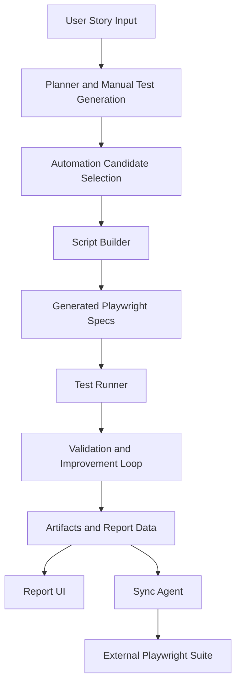

# AI Playwright Framework - Team Documentation

## 1. Architecture

### 1.1 High-level Overview

This project is an AI-assisted test automation framework that converts plain English user stories into executable Playwright test suites, runs them, validates outcomes, and publishes report data for a UI dashboard.

The system supports two operating modes:
- CLI orchestration mode for story-to-test generation and execution.
- Report UI mode for triggering runs and viewing results.

### 1.2 Architecture Diagram

### 1.3 Component Map

- Entry and orchestration:
  - backend/src/index.js
- AI client:
  - backend/src/ai/claudeClient.js
- Generation layer:
  - backend/src/generator/testCaseGenerator.js
  - backend/src/generator/stepGenerator.js
  - backend/src/generator/scriptBuilder.js
- Agent layer:
  - backend/src/agents/plannerAgent.js
  - backend/src/agents/executorAgent.js
  - backend/src/agents/validatorAgent.js
  - backend/src/agents/reporterAgent.js
  - backend/src/agents/improvementAgent.js
  - backend/src/agents/testIntelligenceAgent.js
  - backend/src/agents/syncAgent.js
- Execution layer:
  - backend/src/runner/runGeneratedTest.js
  - backend/playwright.config.js
- UI and reporting:
  - backend/src/ui/buildReportData.js
  - backend/src/ui/serveReportUi.js
  - frontend/report-ui/
- Sync tools:
  - backend/src/tools/syncToExternalPlaywrightSuite.js

### 1.4 Runtime Flow

1. User story is taken from CLI input or user-stories files.
2. Manual test catalog is generated with acceptance criteria mapping.
3. Automatable candidates are selected.
4. Coverage intelligence checks existing generated tests and skips duplicates.
5. Missing scenarios are converted into Playwright spec files.
6. Specs are executed using Playwright.
7. Validation and improvement logic produces feedback and updates artifacts.
8. Report data is built for dashboard consumption.
9. Optional sync agent copies generated tests to an external tester repository.

## 2. What We Used

### 2.1 Languages and Runtime

- JavaScript (ES Modules)
- Node.js runtime

### 2.2 Core Libraries and Tools

- @playwright/test: browser automation and execution
- @anthropic-ai/sdk: Claude integration for text and image-assisted reasoning
- dotenv: environment configuration

### 2.3 Framework and Project Patterns

- Multi-agent orchestration pattern for planning, execution, validation, reporting, and improvement
- Story-based generated output directories for traceability
- Coverage-and-gap detection to reduce duplicate test generation
- Optional self-healing loop for failed generated scripts
- Report normalization for UI-driven analytics
- Optional external suite sync for tester-owned pipelines

### 2.4 MCP Setup (Developer Productivity)

Workspace includes MCP configuration in .vscode/mcp.json for:
- Playwright MCP server
- Filesystem MCP server
- GitHub MCP server

This enables AI-assisted navigation, troubleshooting, and change summarization workflows in MCP-capable clients.

## 3. Why This Is Useful

### 3.1 QA and Delivery Value

- Reduces manual effort by generating test cases and scripts from natural language stories.
- Improves coverage with gap detection instead of repeatedly generating duplicate tests.
- Speeds up defect feedback with direct execution and artifact capture.
- Helps teams standardize quality gates using structured outputs and report dashboards.

### 3.2 Engineering Productivity Value

- Converts business requirements into executable tests faster.
- Supports iterative improvement with failure-aware refinement hints.
- Integrates with separate tester repositories and CI workflows through sync automation.
- Provides both CLI and UI paths for different personas (engineer, QA, demo/presentation).

### 3.3 Leadership and Stakeholder Value

- Better traceability from story to generated test assets.
- Demonstrable automation progress with coverage metrics and run history.
- Reusable pipeline for regression growth as new stories are added.

## 4. Technical Documentation

### 4.1 Prerequisites

- Node.js 18+ recommended
- npm
- Playwright browsers installed
- Anthropic API key

### 4.2 Setup

1. Install dependencies:
   - npm install
2. Install Playwright browsers:
   - npm run playwright:install
3. Create environment file:
   - cp .env.example .env
4. Set required key:
   - ANTHROPIC_API_KEY=<your_key>

### 4.3 Key Commands

- Start report UI server:
  - npm start
- Run core CLI story-to-test flow:
  - npm run start:cli
- Execute generated tests directly:
  - npm run test:generated_tests
- Open Playwright HTML report:
  - npm run report:generated_tests
- Build and serve report UI:
  - npm run ui
- Run sync agent:
  - npm run agent:sync-suite

### 4.4 Configuration Reference

Defined primarily in backend/src/config.js and backend/playwright.config.js.

Important environment variables:
- ANTHROPIC_API_KEY: required for AI generation and validation
- CLAUDE_MODEL: model override
- APP_URL: default target application URL
- DEFAULT_TIMEOUT_MS: global test timeout
- NAVIGATION_TIMEOUT_MS: Playwright navigation timeout
- RETRY_COUNT: retry count for failed tests
- SCREENSHOT_ON_FAILURE: capture behavior
- MAX_AUTOMATED_CASES: generation cap per story
- AGENT_MODE: enable agent loop
- AGENT_MAX_ATTEMPTS: loop cap
- SELF_HEALING_ENABLED: enable in-place script healing attempts

Sync-related variables:
- SYNC_TARGET_DIR
- SYNC_TARGET_SUBDIR
- SYNC_AGENT_ENABLED
- SYNC_GIT_AUTO_COMMIT
- SYNC_GIT_AUTO_PUSH
- SYNC_GIT_CREATE_PR
- SYNC_GIT_PR_BASE_BRANCH

MCP-related variables:
- GITHUB_PERSONAL_ACCESS_TOKEN (for GitHub MCP server)

### 4.5 Output and Artifact Structure

Primary output locations:
- backend/generated_tests/
- backend/artifacts/
- backend/playwright-report/
- backend/test-results/
- frontend/report-ui/data/
- backend/project-data/projects/

Typical generated files per story include:
- manual-test-cases JSON and markdown
- automation-selection JSON
- generated Playwright spec files by test case
- screenshots by case
- multi-agent summary and history files

### 4.6 Operational Workflow (Recommended)

1. Add or update user story text.
2. Run CLI flow to generate and execute scripts.
3. Review generated tests and failed cases.
4. Use report UI for trend and coverage visibility.
5. Optionally sync to tester-managed external Playwright suite.
6. Commit and open PR with generated evidence.

### 4.7 Troubleshooting

- No AI output:
  - Verify ANTHROPIC_API_KEY and network connectivity.
- URL validation errors:
  - Confirm APP_URL is valid http or https format.
- Playwright launch issues:
  - Ensure browsers are installed via npm run playwright:install.
- Empty generation results:
  - Check user story quality and ensure files in user-stories are non-empty.
- Sync failures:
  - Verify SYNC_TARGET_DIR path exists and has required git permissions.

### 4.8 Security and Governance Notes

- API keys should remain in .env and never be committed.
- Generated tests may include sensitive URLs or selectors; review before sharing externally.
- For external sync automation, enforce branch protection and least-privilege tokens.

### 4.9 Extension Points

- Add custom planning/generation prompts in generator and agent modules.
- Add domain-specific selector rules in script generation logic.
- Add additional analytics in report data builder.
- Extend sync logic for organization-specific release flows.

## Presentation Summary (For Team Meeting)

- Problem solved: convert natural-language stories into runnable UI tests faster.
- Core capability: AI-assisted generation, execution, validation, and reporting.
- Practical impact: better speed, consistency, and coverage with reduced manual QA effort.
- Engineering benefit: modular architecture with clear extension points and CI-friendly outputs.
